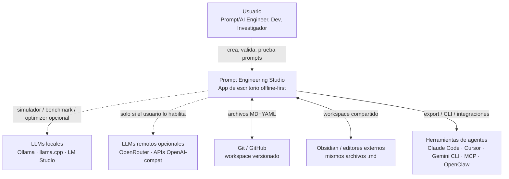
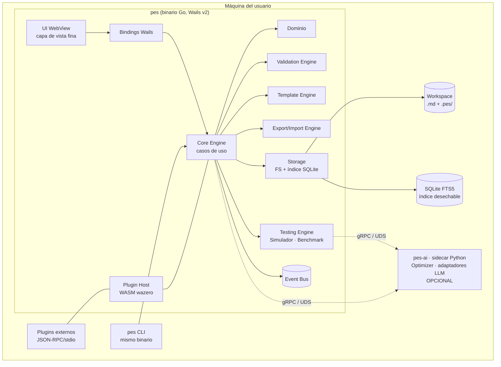
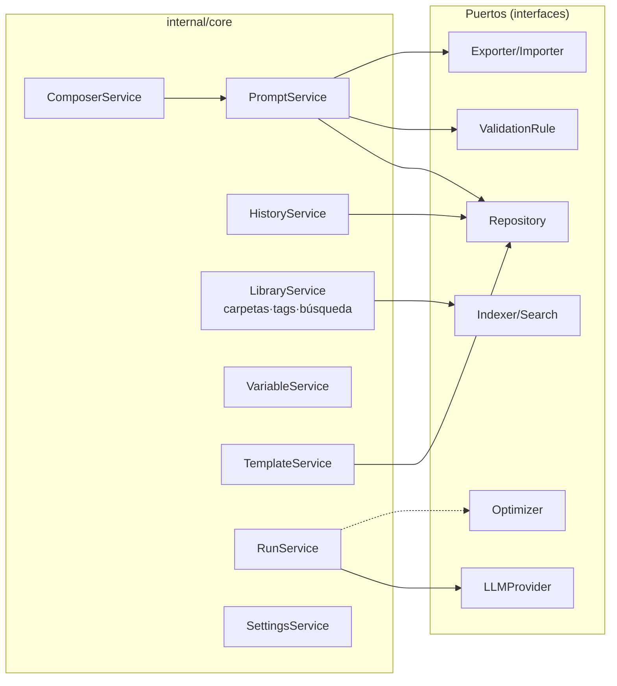
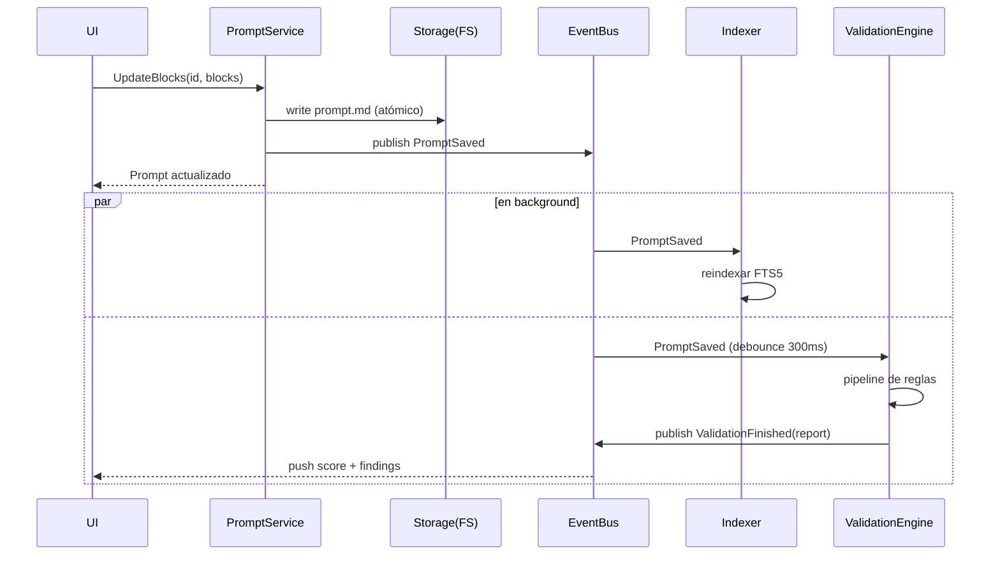
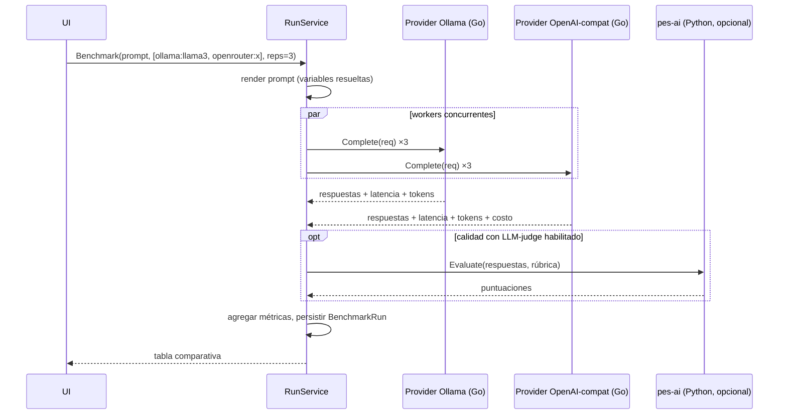
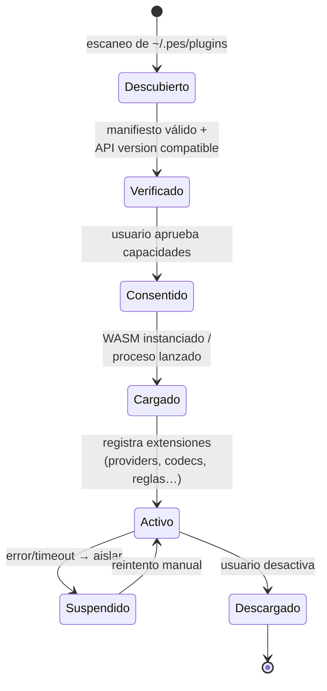
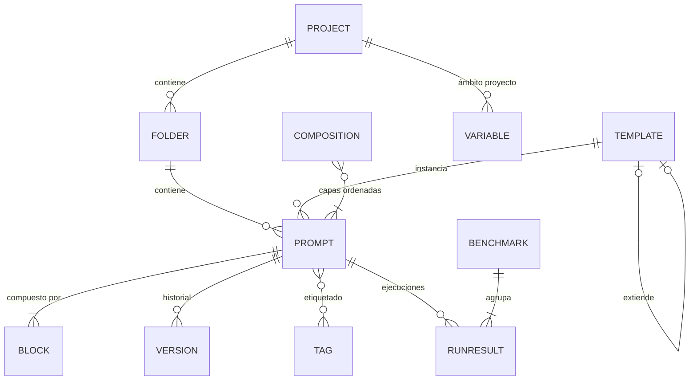
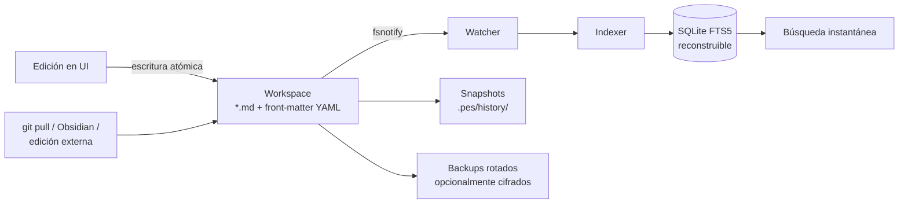

# 3. Diagramas

Todos los diagramas están en Mermaid (renderizables en GitHub, Obsidian y VS Code).

## 3.1 C4 — Nivel 1: Contexto

## 3.2 C4 — Nivel 2: Contenedores

## 3.3 C4 — Nivel 3: Componentes del Core Engine

## 3.4 Secuencia: edición con validación en vivo

## 3.5 Secuencia: benchmark multi-modelo

## 3.6 Ciclo de vida de un plugin

## 3.7 Modelo Entidad-Relación (resumen; detalle en 06)

## 3.8 Flujo de datos de persistencia

